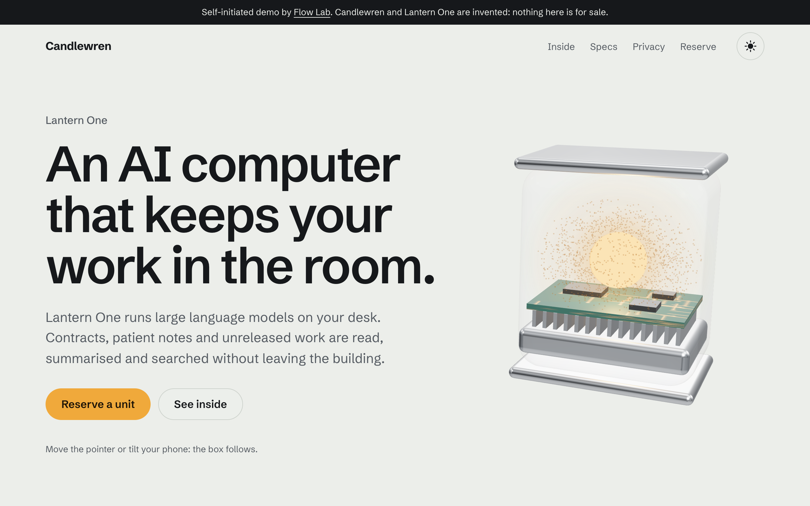
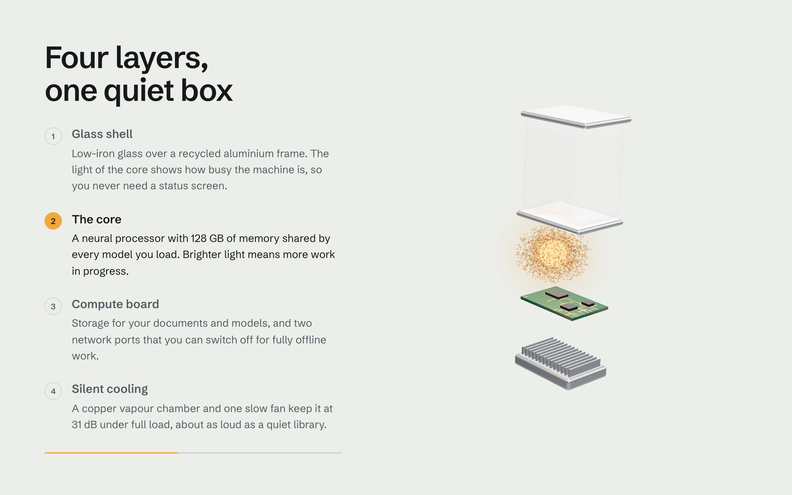
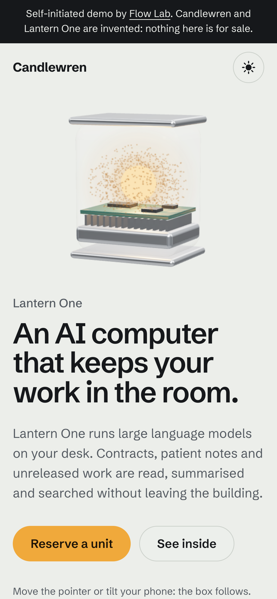

# Lantern One: product site with a live 3D scene (demo)

A self-initiated demo by Flow Lab, not a paid client project. Candlewren and its desktop AI computer, Lantern One, are invented, and so are all the numbers and the price on the page.

- Live demo: https://flowlab-dev.github.io/demo/3d-site/
- Case study: https://flowlab-dev.github.io/work/3d-site/

Built by Flow Lab with Claude Code, with the tests below run before every change ships.

| Inside, layer by layer | On a phone |
|---|---|
|  |  |

## What the page does

1. **A 3D object on the first screen:** a glass case in an aluminium frame with a glowing core, a circuit board and a heat sink. Built in code with three.js, no model files.
2. **It comes apart as you scroll.** The "Inside" section pins, the object drops into it and opens into four layers, each explained in turn (GSAP ScrollTrigger).
3. **Numbers count up** once, when the block comes into view.
4. **A reservation form** that checks every field and explains errors in words. The confirmation is honest: "This is a demo, so nothing was sent."
5. **Light and dark themes**, taken from the system or a switch and remembered; the scene relights for the theme.
6. **Careful modes.** With "reduce motion" nothing pins or moves and every layer is shown as a drawing. Without WebGL, or if the CDN is blocked, the page falls back to drawings and still works.

## Speed

- Render quality adapts to the device and drops by itself if frames get slow.
- Drawing stops while the scene is off screen.
- Measured 60 fps in Chrome on an Apple M1 Mac, at desktop and phone sizes (phone size on the Mac, not on a real phone).

## Run it

Open `demo/index.html` through any static server (ES modules need `http://`), for example:

    npx serve demo

Only three.js and GSAP load from cdn.jsdelivr.net, plus a Google font.

## Tests

    npm test

34 tests: the reveal and quality logic in Node, and the whole page in headless Chrome: the scene, pinning and steps, fading, themes, the form, phones with Safari bars and on their side, reduced motion, no WebGL, missing GSAP, frame rate, contrast and text widths. No packages needed; set `CHROME_PATH` if Chrome is not in the default macOS location.

## A product page like this for you

Write to trading.flowlab@gmail.com or @flowlabdev on Telegram with your product and what the page should show. I will tell you what it takes and whether a lighter first version would do.

## License

MIT
